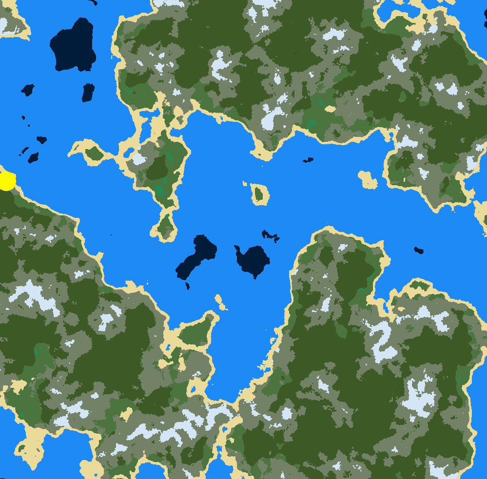
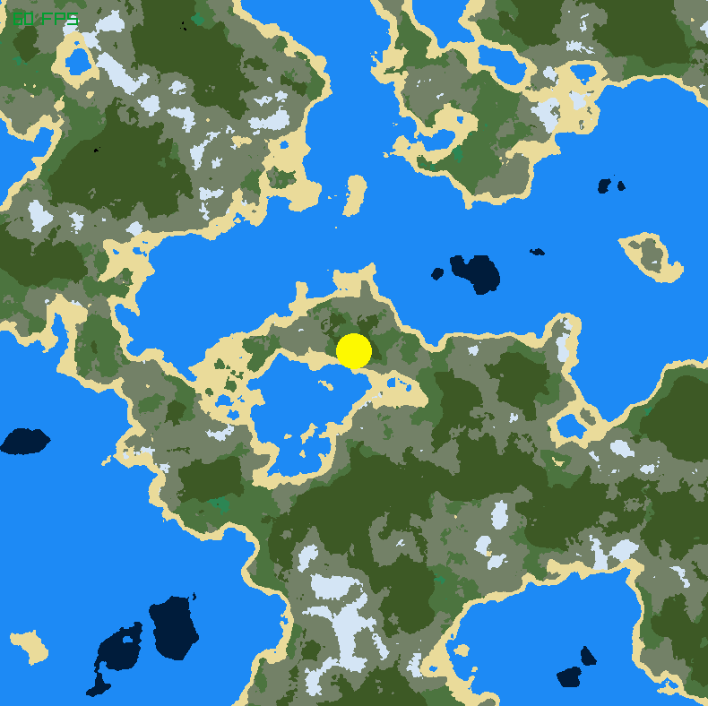
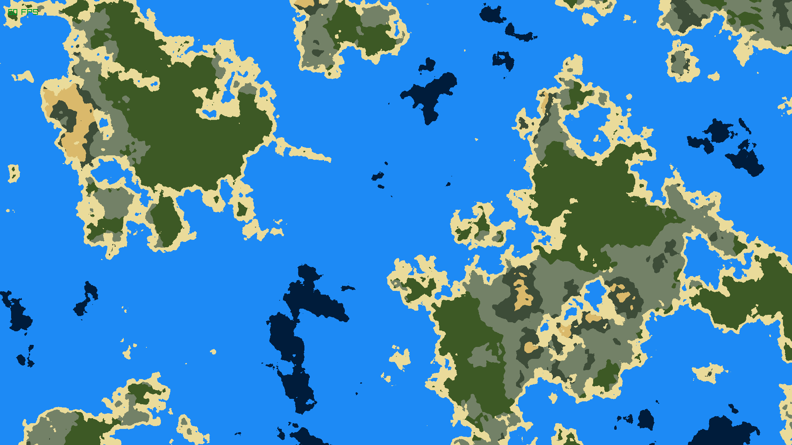

# Procedural Map Generator

This project generates procedural world maps using various noise functions and algorithms. The aim of this project is to generate maps like that of Minecraft or Terraria.

## Features

- Procedural 2D map generation
- Offers high flexibility and customizability, can change many settings by editing files in the `data` folder
- Chunk based generation, that can be extended for infinite world generation

## Requirements

- Meson
- Ninja
- Raylib
- Fmtlib
- A C++ Compiler

## Building

1. Clone the repository:
    ```sh
    git clone https://github.com/ananthv/procedural-map-generator.git
    cd procedural-map-generator
    ```

2. Run meson
    ```sh
    meson wrap install fmt
    meson setup build -Dbuildtype=release
    ```

3. Build the application
    ```sh
    cd build
    ninja -j8
    ```

4. Copy the data folder into the build directory
    ```sh
    cp -r data build
    ```

## Usage

Run the application,

On Linux
```sh
./src/mapgen 
```

On Windows
```
src/mapgen.exe
```

To customize map generation, edit `data/biomes.txt` and `data/config.txt`

Note: You must run the executable, with the data folder present in the same folder as the executable

## Generated maps





## License

This project is licensed under the MIT License. See the [LICENSE](LICENSE) file for details.
